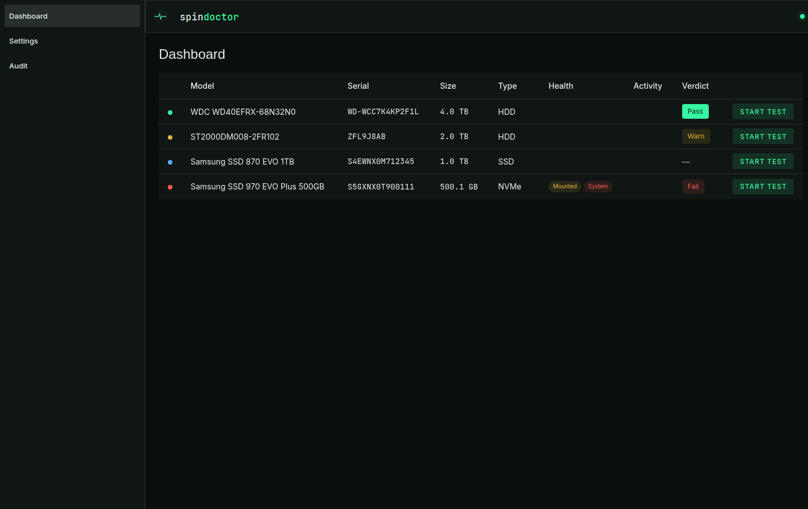
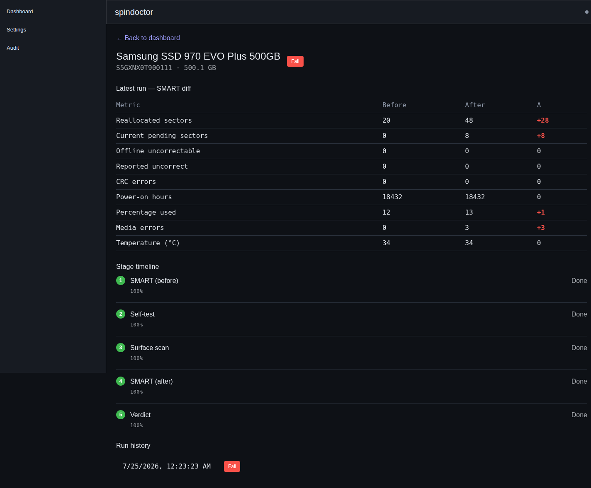
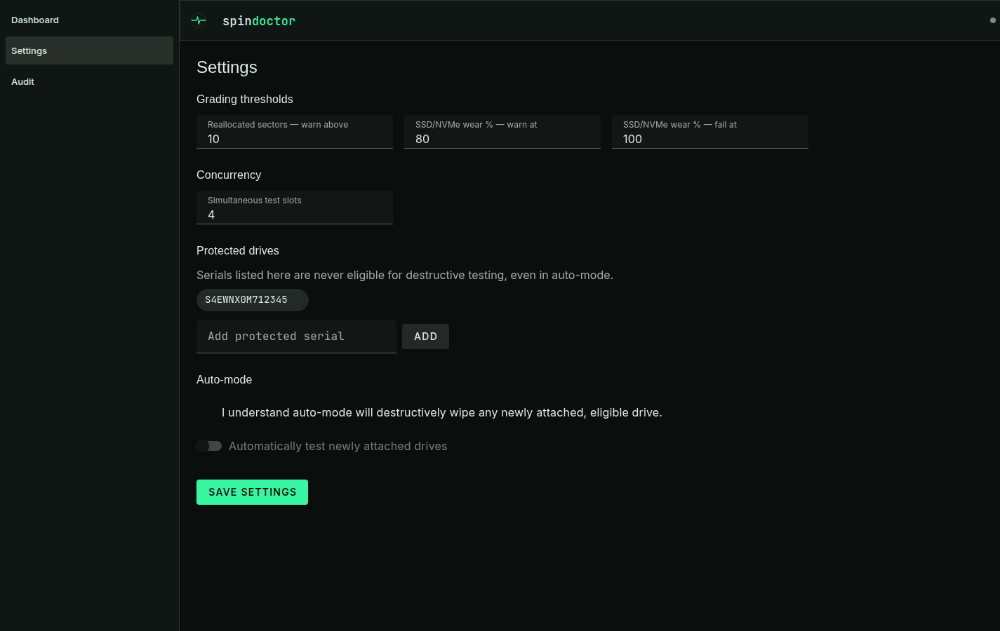

# spindoctor

Qualify used and refurbished drives before you trust them: SMART → long
self-test → destructive surface scan (`badblocks -w`) → SMART again →
**PASS / WARN / FAIL** — driven from a live web console.

[](https://github.com/maxiwolleb/spindoctor/actions/workflows/ci.yml)
[](https://maxiwolleb.github.io/spindoctor/)
[](https://maxiwolleb.github.io/spindoctor/)
[](LICENSE)
[](https://github.com/maxiwolleb/spindoctor/packages)

> [!WARNING]
> **In active development — not ready for use.** spindoctor is still a work
> in progress: APIs, the database schema, and behavior can change without
> notice, and it hasn't been validated across a wide range of real drives
> yet. Treat it as an evaluation preview — run it in a lab, not on hardware
> or data you care about.

## ⚠️ Safety warning

**The destructive test IRRECOVERABLY WIPES the drive under test.** The
surface stage runs `badblocks -w`, a destructive write-pattern scan — it
erases all data on the drive, with no way to get it back. Only point
spindoctor at drives whose data you do not need.

There are guards, and they are always on — for read-only runs as well as
destructive ones:

- a drive **something else is using** is never eligible. spindoctor asks the
  kernel for exclusive access and refuses the drive if that is denied — which
  covers a mounted filesystem (in any mount namespace, including the host's),
  an LVM or md member, and swap. It works from inside the container, where the
  host's mount table is not visible at all. It does not detect a writer that
  never claimed the device exclusively, such as a raw `dd` running outside
  spindoctor;
- a drive that is **mounted in spindoctor's own mount namespace** is never
  eligible (this is the one that fires when spindoctor runs on the host);
- the host's own **system disk** is never eligible, as far as spindoctor can
  identify it — see the caveat below;
- any drive you add to the **protected-serial list** (Settings) is never
  eligible, including in auto-mode;
- starting a destructive run — manually or via auto-mode — requires
  **typing the drive's serial number** to confirm, in the UI and enforced
  again by the API.

**The caveat, stated plainly.** Running in a container, spindoctor cannot see
which disk the host booted from: `lsblk` reports mountpoints for the
container's own mount namespace, not the host's. The exclusive-access check
above is what protects a live system disk in practice, because a mounted disk
is a claimed disk. But if that check cannot run on your setup, spindoctor says
so in the log and on the drive rather than reporting a reassuring "not
mounted" — and you can name the system disk explicitly, which is
namespace-proof and survives device renumbering:

```yaml
environment:
  # Serials spindoctor must always refuse, comma-separated. Read them off the
  # drives, or with `lsblk -o NAME,SERIAL,MOUNTPOINTS` on the host.
  - SPINDOCTOR_SYSTEM_DISK_SERIALS=YOUR-SYSTEM-DISK-SERIAL
```

These guards reduce risk, they do not eliminate it. You are the one who
decides which drives get passed into the container in the first place
(see the device-passthrough note below) — spindoctor cannot warn you about
a drive it was never told to protect. Double-check `lsblk` before you pass
any device through.

## Screenshots

| Dashboard                                                                               | Drive detail                                                                               | Settings                                                                                           |
| --------------------------------------------------------------------------------------- | ------------------------------------------------------------------------------------------ | -------------------------------------------------------------------------------------------------- |
|  |  |  |

- **Dashboard** — every discovered drive with its model, serial, size,
  type, mount/system state, and latest verdict; start a test per drive.
- **Drive detail** — the SMART before/after diff for the latest run, the
  per-stage timeline, and run history.
- **Settings** — grading thresholds, test concurrency, the protected-serial
  list, and the auto-mode acknowledgment + toggle.

## Quickstart

> [!IMPORTANT]
> Only pre-release images are published so far; the newest is
> **`ghcr.io/maxiwolleb/spindoctor:0.0.2-alpha`**. There is deliberately no
> `:latest` tag yet — it is reserved for the first non-prerelease version, so
> that pulling `:latest` never silently gets you an alpha. Use the exact tag:
>
> ```
> image: ghcr.io/maxiwolleb/spindoctor:0.0.2-alpha
> ```
>
> Or build from a checkout:
>
> ```
> git clone https://github.com/maxiwolleb/spindoctor && cd spindoctor
> docker build -t spindoctor:local .
> ```

```yaml
# docker-compose.yml
services:
  spindoctor:
    image: ghcr.io/maxiwolleb/spindoctor:0.0.2-alpha
    ports:
      - "8080:8080"
    volumes:
      - ./data:/data
      # Uncomment together with the passthrough block below. lsblk reads drive
      # serials from the host's udev database; without this mount every disk
      # comes back with no serial and NOTHING is discovered — the dashboard
      # just stays empty.
      # - /run/udev:/run/udev:ro
    restart: unless-stopped

    # Device passthrough — REQUIRED for real SMART/badblocks/hdparm access,
    # OFF by default so a plain `docker compose up` never touches host disks.
    # ⚠️ DESTRUCTIVE: any drive passed through here can be WIPED. Uncomment
    # one of the two blocks below, list the exact drives via `devices:`
    # (check with `lsblk` first), and add the /run/udev mount above before
    # enabling this.
    #
    # privileged: true
    # # — or, narrower —
    # cap_add:
    #   - SYS_RAWIO
    #   - SYS_ADMIN
    # devices:
    #   - "/dev/sdX:/dev/sdX"
```

If the dashboard comes up empty with passthrough enabled, check the container
log: every block device discovery ignores is logged with the reason. A missing
`/run/udev` mount is the usual cause.

```
docker compose up -d
```

Open `http://localhost:8080`. Without the device-passthrough block
uncommented, the UI comes up and the dashboard works, but drive discovery
will not see any real disks — that's intentional, so a plain
`docker compose up` never touches host block devices by accident.

A full example is in [`docker-compose.yml`](docker-compose.yml).

## How it works

### The regime

Each test run walks a fixed, ordered set of stages:

```
SMART_BEFORE → SELFTEST_LONG → SURFACE → SMART_AFTER → VERDICT
```

- **SMART_BEFORE / SMART_AFTER** — `smartctl` snapshots, before and after.
- **SELFTEST_LONG** — the drive's own firmware long self-test.
- **SURFACE** — `badblocks`, in destructive (`-w`) or read-only mode
  depending on how the run was started.
- **VERDICT** — the before/after SMART diff, self-test result, and surface
  result are evaluated against thresholds to produce PASS/WARN/FAIL with
  structured reasons.

Runs are durable: an interrupted self-test resumes by polling the drive's
own firmware state, and a killed surface stage restarts, both on backend
startup.

### Verdict thresholds

- **Reallocated sectors:** `0` → PASS; `1`–`4` and stable → WARN; above
  `4`, or grown during the test window, → FAIL. (`4` is the default
  `reallocatedWarnMax` threshold — configurable in Settings.)
- **Current pending / offline uncorrectable / reported uncorrectable
  sectors:** any value `> 0` after the test → FAIL.
- **Spin retries:** any value `> 0` → FAIL. A drive that needed a retry to
  bring its platters to speed fails at roughly ten times the rate of one
  that never did.
- **Command timeouts:** above `100` → WARN (default
  `commandTimeoutWarnMax`, configurable). A handful of timeouts is as often
  a cable as a drive.
- **SSD/NVMe wear** (`percentageUsed`): `≥ 80%` → WARN, `≥ 100%` → FAIL
  (defaults, configurable).
- **Surface scan:** any bad block found → FAIL.
- A failed long self-test → FAIL; an aborted/incomplete self-test or
  surface scan → WARN. A surface scan that could not **start** is different:
  the run fails outright with no verdict, since the drive was never measured.
- Interface CRC errors → WARN (check cabling).
- NVMe media errors → FAIL.
- **The drive's own SMART health verdict** reporting failure → FAIL. On SAS this
  is authoritative ("impending failure, data error rate too high"); on ATA it
  can condemn a drive but is never taken as proof one is healthy, since it
  routinely still reads "passed" on a failing disk.
- **SAS/SCSI grown defects:** present but stable → WARN; grown during the test
  window → FAIL. Deliberately no absolute-count FAIL: measured across a fleet of
  in-service SAS drives, counts on healthy drives and on drives reporting
  impending failure overlap completely, so the count alone cannot decide.
- **SAS link errors** (invalid DWORDs, loss of sync) → WARN — usually the
  cable/backplane rather than the drive.

### Auto-mode

Auto-mode continuously polls attached drives and automatically starts a
**destructive** run on every newly-discovered, eligible drive — no manual
click required. It is:

- **off by default**;
- **opt-in**, and gated behind an explicit checkbox acknowledgment in
  Settings ("I understand auto-mode will destructively wipe any newly
  attached, eligible drive") before the toggle can even be enabled;
- still subject to the same safety guards as a manual start — a mounted,
  system, or protected-list drive is never enqueued, auto-mode or not.

### Safety model

See the safety warning above — the guards
(mounted/system/protected-list exclusion, typed-serial confirmation) are
enforced both in the UI and again server-side on `POST /api/runs`, so they
hold even if a client bypasses the UI.

## Configuration

Environment variables (all optional — defaults shown are what the Docker
image sets):

| Variable                    | Default                                                              | Purpose                                                                                                                |
| --------------------------- | -------------------------------------------------------------------- | ---------------------------------------------------------------------------------------------------------------------- |
| `SPINDOCTOR_DB`             | `/data/spindoctor.sqlite` (image) / `./data/spindoctor.sqlite` (dev) | Path to the SQLite database file.                                                                                      |
| `PORT`                      | `8080`                                                               | HTTP port the backend listens on.                                                                                      |
| `HOST`                      | `0.0.0.0`                                                            | Interface the backend binds to.                                                                                        |
| `SPINDOCTOR_WEB_ROOT`       | built-in `apps/web/dist` path                                        | Directory of the built SPA served as static files.                                                                     |
| `SPINDOCTOR_MIGRATIONS_DIR` | resolved next to the backend source                                  | Overrides where Drizzle looks for migration files — only needed if your deploy layout differs from the shipped image.  |
| `LOG_LEVEL`                 | `info`                                                               | `fatal`/`error`/`warn`/`info`/`debug`/`trace`/`silent`. An unrecognized value falls back to `info`.                    |
| `LOG_FORMAT`                | `pretty`                                                             | `pretty` for colored, human-readable lines in `docker logs`; `json` for newline-delimited JSON to ship to a collector. |

Everything else is configured at runtime through the **Settings** page in
the web UI: grading thresholds (reallocated-sector warn limit, SSD/NVMe
wear warn/fail limits), test concurrency, the protected-serial list, and
the auto-mode toggle.

## Development

spindoctor is a pnpm workspace monorepo:

- `apps/backend` — Fastify + TypeScript (REST + live events), SQLite via Drizzle.
- `apps/web` — Vue 3 + Vuetify, built with Vite.
- `packages/shared` — wire types shared by both sides (source-only, no
  build step).

Requires Node ≥ 22 and pnpm ≥ 9.

```
pnpm install
pnpm dev                              # backend + web, both in watch mode
pnpm test                             # vitest, whole workspace
pnpm -r typecheck                     # typecheck every package
pnpm --filter @spindoctor/web build   # production SPA build
```

The backend runs under `tsx` (not a bundler) in both development and
production, so `packages/shared`'s source-only exports resolve the same
way everywhere.

## Testing

Tests are written before (or alongside) the code they cover, and are built to
run anywhere without touching real hardware:

- **Pure, deterministic core.** The verdict evaluator
  (`apps/backend/src/verdict`) and the device-output parsers (`smartParser`,
  `lsblkParser`, `badblocksParser`, `scanParser` under `apps/backend/src/device`)
  are plain functions with no I/O — they're exercised against captured
  `smartctl`/`lsblk`/`badblocks`-shaped fixtures with a scenario per
  threshold/edge case (clean, warn, fail, boundary values, missing metrics).
- **Nothing real runs.** All disk access goes through a `DeviceApi`
  interface; tests use `FakeDeviceApi` (in-memory, scripted responses)
  instead of the real implementation. No test in this repo runs `smartctl`,
  `badblocks`, or `lsblk` against an actual disk, and none ever will —
  destructive commands are never exercised against real hardware in
  tests or CI.
- **No wall-clock waits.** The engine's poll loops (self-test polling,
  auto-mode discovery) take an injectable `sleep` function instead of calling
  `setTimeout` directly, so tests drive them deterministically without real
  delays or flaky timing.
- **The one real-I/O path is emulated, not mocked away.** The surface-scan
  runner does spawn a real child process, so it's tested against a small
  Node script (`__testhelpers__/fake-badblocks.mjs`) that stands in for the
  `badblocks` binary — same stdout/stderr/log-file shape, so the runner's
  process handling (progress parsing, abort/kill, spawn failures) is
  exercised for real without needing `badblocks` or a disk to be present.

Run the suite:

```
pnpm test             # vitest, whole workspace
pnpm test:coverage     # same, plus a v8 coverage report (text + html + lcov)
```

## No auth in v1

The web UI and API have **no authentication** in this version. It is
built for a trusted LAN — do not expose it directly to the internet.

## Documentation

Full docs, including install/run, how-it-works, safety, configuration, and
architecture guides, are at
**[maxiwolleb.github.io/spindoctor](https://maxiwolleb.github.io/spindoctor/)**.

### Test coverage

`pnpm test:coverage` reports it locally; CI runs the same command and fails
below the thresholds in `vitest.config.ts`. The badge at the top is served from
the docs site itself (`coverage.json`, written by the `Docs` workflow), so it
tracks `main` without a third-party coverage service.

The docs site (`website/`, VitePress) builds and deploys to GitHub Pages
from `main` via the [`Docs`](.github/workflows/docs.yml) workflow — see
[CONTRIBUTING.md](CONTRIBUTING.md#documentation) for details.

## License

[MIT](LICENSE)
